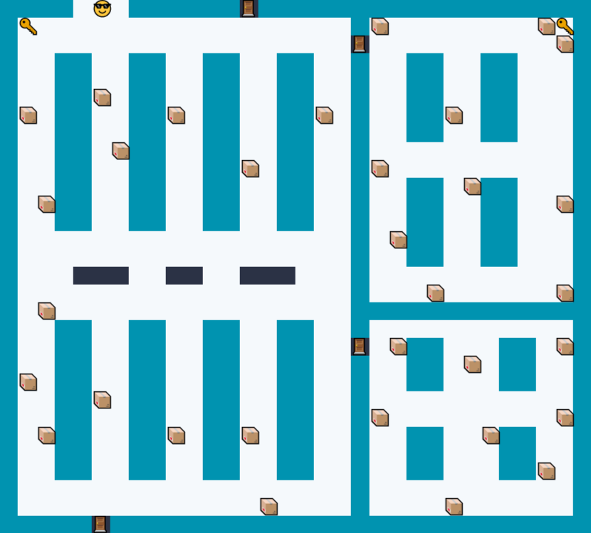

<h1 align="center"> LABIRINTO AMAZON FRESH </h1>

Projeto desenvolvido em sala de aula durante as aulas do curso Técnico de Desenvolvimento de Sistemas, na matéria: Fundamentos de Lógica de Programação Orientada a Objetos.

  <a href="#-tecnologias">Tecnologias</a>&nbsp;&nbsp;&nbsp;|&nbsp;&nbsp;&nbsp;
  <a href="#-projeto">Projeto</a>&nbsp;&nbsp;&nbsp;|&nbsp;&nbsp;&nbsp;
  <a href="#-layout">Layout</a>&nbsp;&nbsp;&nbsp;|&nbsp;&nbsp;&nbsp;
  <a href="#-como-utilizar">Como utilizar</a>&nbsp;&nbsp;&nbsp;|&nbsp;&nbsp;&nbsp;
  <a href="#memo-licença">Licença</a>

  

 

  

## 🚀 Tecnologias

Esse projeto foi desenvolvido com as seguintes tecnologias:

- JavaScript
- Git e Github

## 💻 Projeto

Este labóratório foi uma entrega onde o projeto é um mapa que simula o mercado da Amazon Fresh, mostrando o melhor caminho para o cliente coletar seus produtos. O mapa conta com capacidade de produtos que analisa se o cliente está com cesto ou carrinho ou sem nada. O sistema analisa seu saldo e desconta após cada produto pego. 
- Link do Replit: [Projeto Amazon Fresh - SENAI](https://replit.com/@RenanGabriel14/Amazon-Fresh?v=1)

## 🔖 Layout

O layout foi desenvolvido pelos membros do grupo e é todo criado por códigos em lista e uma biblioteca de cores [cli-color](https://www.npmjs.com/package/cli-color).

## 🎮 Como utilizar

OBRIGATÓRIO INSTALAR TODAS BIBLIOTECAS*

- W - Anda para cima
- A - Anda para esquerda
- S - Anda para baixo
- D - Anda para direita

Selecione a quantia de dinheiro para iniciar;

Teletransporte de mapas nas portas localizadas nas partes inferiores e superiores do mapa;

Chaves localizadas no mapa para abrir portas de salas trancadas;

Carrinho e cestos aumentam a capacidade e produtos que podem ser pegos;

Cada produto pego desconta R$ 10,00 e 1 de capacidade;

Digite "Reset" para resetar o tudo.

## :memo: Licença

Esse projeto está sob a licença MIT.

---

Feito por: 
- Renan :wave: [LinkedIn](https://www.linkedin.com/in/renan-gabriel/) | [GitHub](https://github.com/renangabriel08)
- Daniel :wave: [LinkedIn](https://www.linkedin.com/in/danielfernandes0304/) | [GitHub](https://github.com/Daniel-Fernandes0304)
- Leonardo :wave: [GitHub](https://github.com/LeoMazuka)
- Samuel :wave: [LinkedIn](https://www.linkedin.com/in/samuel-gon%C3%A7alves-493b7a255/) | [GitHub](https://github.com/Muelson)
- Gabriel :wave: [LinkedIn](https://www.linkedin.com/in/gabsouzkkj/) | [GitHub](https://github.com/gabsouzkkj)
- Vitor :wave: [LinkedIn](https://www.linkedin.com/in/vitor-junior-25230b249/) | [GitHub](https://github.com/vitornegueba)
- Lucas :wave: [GitHub](https://github.com/xxxlucasmatheus)
- Mateus :wave: [GitHub](https://github.com/mateussantospereira)
